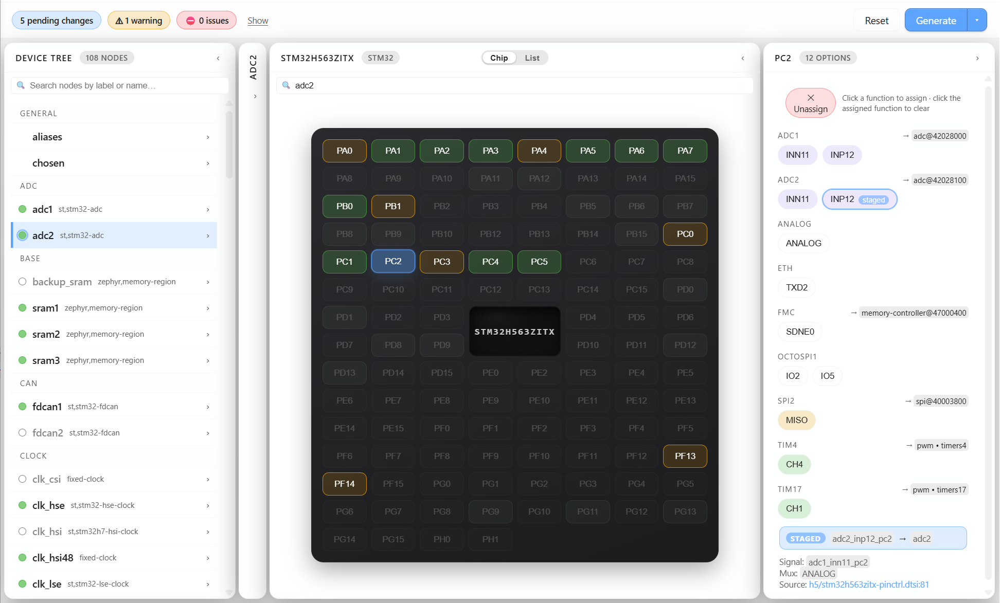

# Devicetree Manager for Zephyr

Devicetree editor and pin configurator for Zephyr RTOS projects. Companion
extension to [Workbench for Zephyr](https://github.com/Ac6Embedded/vscode-zephyr-workbench).

## What it does

A workbench panel that shows, for the currently selected Zephyr
application + build configuration, a unified view of every editable
surface of the devicetree:

- Pin muxing (chip pin matrix, vendor-themed)
- Devicetree node tree with binding-typed property editors
- Per-node detail card with tabs (Properties, Channels, Groups, Pin Groups, Regions, ...)
- Staging + overlay generation: writes `boards/<board>.overlay` with
  per-block, per-property merge so user edits survive regenerations.

Generalised so the same view works for any vendor whose HAL ships
machine-generated pinctrl descriptions (today: STM32, NXP MCX,
ESP32; tomorrow: anyone we add a backend for).

## Requirements

- A Python interpreter with `edtlib` (typically the Zephyr venv the
  Workbench is already configured against).

## Bundled (non-blocking)

- [Workbench for Zephyr](https://github.com/Ac6Embedded/vscode-zephyr-workbench)
  ships as an **extension pack** member, so installing this extension also
  installs the Workbench. It is a **soft dependency**, though: DT Manager
  does not require it to activate. When the Workbench is present, this
  extension talks to its API to discover Zephyr applications and build
  configurations and to reuse its configured Zephyr venv. If you disable or
  uninstall the Workbench, the panel still opens standalone on a build
  directory (see "How to open" below) and falls back to its own Python
  discovery.

## How to open

- From the Zephyr Workbench shortcut tree, click **Devicetree Manager**
  on an application or build configuration. The Workbench delegates to
  this extension via VSCode's command API and hands over the selected
  application + build config.
- From the command palette: `Devicetree Manager: Open`. Pick the app
  and build configuration inside the panel.

## Issues and feature requests

Bug reports and feature requests for this extension go on the
[Zephyr Workbench issue tracker](https://github.com/Ac6Embedded/vscode-zephyr-workbench/issues),
not on this repository. This repo only carries the public artefacts
(icon, README, CHANGELOG, LICENSE) the VS Code Marketplace links
against; the source code is maintained internally by Ac6.

## License

See [LICENSE](./LICENSE). Free to install and use; proprietary
(closed source).
